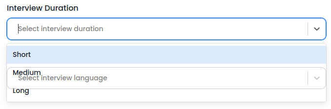
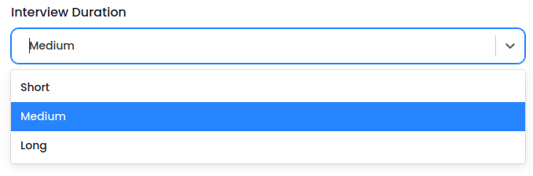

The Internet Folks (TIF) Task 1: Build feature

## Added Features:

1. The values in the preview card is gets updated whenever the user inputs in the form on each page.

   - I did this in two way.(Branch "`another-version`" will show the another way.)

     1. (main)I added a logic in each form, whenever the input element's `onchange` event triggers, the new function that i written is gets called. Initial `onchange` function will be called along with new instructions. It calls the setState of `DataProvider's useData` hook. By checking the name of current element that triggered the event. The value will be assigned correctly.

     1. (another-version)As all the input & select elements are from two components. So, I added a function to run whenever the `onchange` event triggers. Here, i added new prop `tab` to `<FormInput/> and <FormSelect/>` which holds the current tab name, by using the current tab name and current input name, I updates the value `state[tab][name] = value`. In this way, we no need to write the logic for updating state in every new tab(form) we add. (I choose 1st way because this way is not possible with Typescript, unless a large amount of refractor is done).

1. The tabs can be changed only when the user clicks on next/previous. Every forms can submitted whenever all the fields are filled with valid values. When the user goes to previous tab, all the fields will filled with the values.

## Fixed Bugs

1. On the job details form when the user submits the form it doesn’t go to the next step even when there are no errors on the screen. This is because, in Formik declaration, there are 4 field which are required, but only 3 field are added in the form, therefore, we cannot see the error on the screen. So, Formik is not submitting the form as all the field are not filled with valid details. So, i removed the unnecessary field.
1. Added validations for the interview settings form.
1. The react-select options are overlapping with the below elements. This is happening because of the `<InputGroup/>` component. So, i removed it  
   **Before:**
   
   **After:**
   
1. While I was working on this project, I have encountered a warning says `Prop id did not match` of react-select-3 which is related to hydration issue in next.js. I resolved this warning by adding `instanceId={name}` prop to `<ReactSelect />` component
